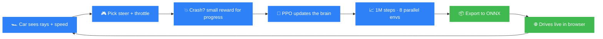

<div align="center">

# 🏎️ Raceline

### Watch a car teach itself to race.

It starts knowing nothing and drives straight into the first wall. A few hundred practice laps later it's threading corners and stringing together clean, fast laps - then drives live in your browser.

[](LICENSE)
[](https://www.python.org/downloads/)
[](https://gymnasium.farama.org/)
[](https://stable-baselines3.readthedocs.io/)
[](https://onnxruntime.ai/docs/tutorials/web/)
[](#-why-no-gpu)

</div>

---

## 🧠 The Idea

The car sees only a handful of distance sensors (rays to the nearest wall) plus its speed - no map, no labels. PPO rewards it for progress around the track and penalizes crashing. After ~1M steps of practice it laps cleanly, every time. The trained brain exports to ONNX and runs **entirely in a browser**, with a toggle to flip between the untrained car (instant crashes) and the trained one (clean laps) on the same track, sensor rays drawn live.

> The most satisfying kind of RL demo: you literally watch the thing get good. No dataset, no labels, no cloud. The car learns purely by crashing, getting a little reward for progress, and trying again.

---

## 🔁 The Loop



---

## 📊 Results

Trained policy vs baselines, 30 held-out seeds:

| Driver | Laps (IQM) | 95% CI | Crash rate | Lap time |
|---|:---:|:---:|:---:|:---:|
| 🏆 **Raceline (PPO)** | **1.0** | [1.0, 1.0] | **0%** | **117 steps** |
| Follow-longest-ray | 0.0 | [0.0, 0.0] | 100% | - |
| Random | 0.0 | [0.0, 0.0] | 100% | - |

The confidence intervals separate cleanly, so the RL win is real - not a cherry-picked lap. Training finishes 1M steps in **under 3 minutes** on a laptop CPU.

| | Untrained (episode 0) | Trained (Raceline) |
|---|---|---|
| First corner | drives straight into the wall | brakes, turns, holds the line |
| A full lap | never finishes | clean laps, repeatably |
| How it knows | random flailing | learned which sensor readings mean "turn now" |

---

## 🧩 What's Inside

Four layers, each usable on its own:

| | Layer | What it is |
|---|---|---|
| 🏁 | **Environment** | A custom Gymnasium env (`RaceTrackEnv`) - top-down car with ray sensors on a walled track |
| 🧠 | **Training** | PPO (Stable-Baselines3) across 8 parallel envs, plus baselines to beat |
| 📏 | **Evaluation** | Seed-aware harness - laps, crash rate, lap time with bootstrap CIs (not one lucky run) |
| 🌐 | **Web demo** | The ONNX policy driving live via `onnxruntime-web`. Zero backend |

---

## 🚀 Get It Running

```bash
# Python 3.11 (torch / SB3 wheels are not on 3.14 yet)
uv venv --python 3.11 && source .venv/bin/activate
uv pip install -e .

# 1. sanity-check the environment (random driver, no training)
python -m raceline.envs.racetrack_env --selftest

# 2. train the PPO driver (8 parallel envs, CPU, ~3 min)
python -m raceline.train --config configs/ppo.yaml

# 3. evaluate the trained car vs baselines, with confidence intervals
python -m raceline.eval --checkpoint runs/ppo/best_model.zip

# 4. export to ONNX for the browser demo
python -m raceline.export_onnx --checkpoint runs/ppo/best_model.zip --out web/policy.onnx

# 5. watch it drive
cd web && python -m http.server 8753   # then open http://localhost:8753
```

**Prefer a notebook?** `notebooks/raceline.ipynb` trains the car, plots the learning curve, evaluates across seeds, and animates a learned lap inline:

```bash
uv pip install -e ".[notebook]"
jupyter lab notebooks/raceline.ipynb
```

---

## ⚡ Why No GPU?

This project is CPU-bound on purpose. Training time is dominated by stepping the Python car simulator, and the policy net is tiny (`[64, 64]`), so a GPU does not help and usually hurts (transfer overhead beats the small matmul; SB3 recommends CPU for `MlpPolicy`). The real speedup is **parallel environments** - many cars at once:

| Setup | 100k steps | Speedup |
|---|:---:|:---:|
| 1 env | 36.9s | 1.0x |
| 8 envs (`SubprocVecEnv`) | 16.1s | **2.3x** |

The notebook has a `DEVICE` toggle (`"cpu"` / `"mps"` / `"cuda"`) so you can benchmark it yourself.

---

## 📚 Documents

- [NORTH_STAR.md](NORTH_STAR.md) - what it is today, the vision, the next moves.
- [ROADMAP.md](ROADMAP.md) - phased build plan, highest value first.
- [PROJECT.md](PROJECT.md) - the car physics, the MDP, reward design, eval protocol.

---

<div align="center">

**MIT licensed.** Built to watch a little car get good at something. 🏎️💨

</div>
